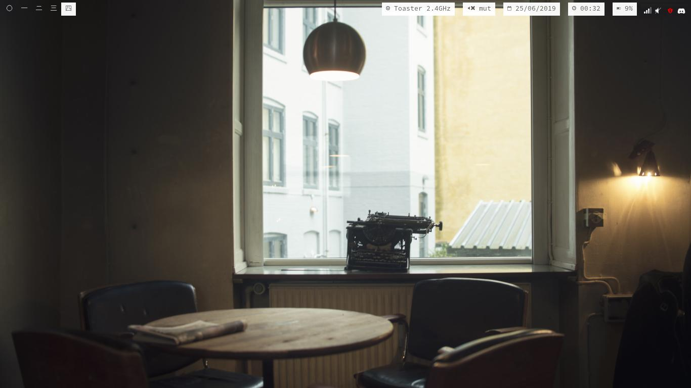

# SzyJ dots
Time-stamp: <25-06-2019>

Welcome to my Linux configs

## System
* OS: Manjaro Linux
* Laptop: ThinkPad X220
* Shell: Bash

## Programs
* WM: i3-gaps with Polybar
* Shell: ZShell (with oh-my-zshell)
* Editor: Emacs
* File Manager: Ranger
* Terminal: [st](https://github.com/SzyJ/st)

## Screenshots

